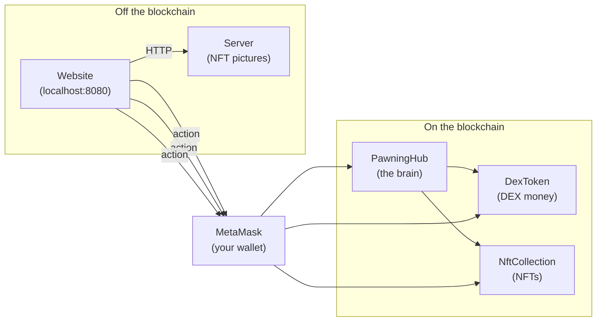

# Project 3 — DEX-NFT Pawning Dapp (simple guide)

**Group:** GROUP_20 — Lenny Briclet, Valentin Barner
**Course:** Decentralized Computing and Blockchains (DI-FCUL 2025/26)

---

## How to read this document

This document explains the project for **someone who has never used blockchain before**. Every technical word has a short definition the first time it appears. Read **section 1 (Vocabulary)** first, then the rest will feel easier.

---

## 1. Vocabulary (read this first)

| Word | Plain meaning |
|------|--------------|
| **Blockchain** | A shared computer that nobody controls. Everyone can read it. To change it you must pay a small fee. |
| **Smart contract** | A small program that lives on the blockchain. Once it is on the blockchain, it cannot be changed. |
| **Solidity** | The programming language we write smart contracts in. |
| **Wei** | The smallest unit of ETH. `1 ETH = 10^18 wei`. We always use wei in code so we don't lose precision. |
| **Gwei** | A bigger wei. `1 gwei = 10^9 wei`. Often used for gas prices. |
| **Gas / gas fee** | A small fee in ETH you pay every time you change something on the blockchain. |
| **Wallet** | An account on the blockchain. It has an address (like an IBAN: `0xabc...`) and a private key (like a password). |
| **MetaMask** | A browser extension that holds your wallet and signs your transactions. |
| **Transaction (tx)** | An action you ask the blockchain to do (send money, call a function...). It needs gas and a signature. |
| **ABI** | A description of all the functions of a contract, used by the frontend so it knows how to talk to the contract. |
| **ERC20** | A standard for fungible tokens (interchangeable money, like euros). All ERC20 tokens have `transfer`, `balanceOf`, `approve`. |
| **ERC721** | A standard for non-fungible tokens (NFTs). Each token has a unique `tokenId`. |
| **NFT** | A unique digital item (an "NFT" is one ERC721 token). |
| **Mint** | Create a new NFT. |
| **Burn** | Destroy an NFT (it disappears forever). |
| **Token** | A unit on a contract. Can be money (ERC20) or a unique item (ERC721). |
| **Approve / allowance** | Saying "the contract X is allowed to take up to Y of my tokens". Without approve, no contract can move your tokens. |
| **Owner** | The address that deployed the contract or has admin rights. |
| **Deploy** | Send a contract for the first time onto the blockchain. |
| **Hardhat** | A tool that gives us a fake local blockchain (chain ID **31337**) to test before going to a real one. |
| **DEX** | In our project: the name of our ERC20 token (we just call it "DEX"). |
| **Collateral** | Money or items you lock to guarantee a loan. If you don't pay back, the lender keeps the collateral. |
| **LTV (Loan To Value)** | If you lock 100 in collateral and you can borrow 50, that's "50% LTV". |
| **Cycle** | A small period (60 seconds in our project) during which the borrower must pay one slice of interest. |
| **Interest** | The price you pay to borrow money (10% of the borrowed amount in our project). |
| **Termination fee** | An extra fee paid when you close the loan early (`0.001 ETH` here). |
| **Liquidation** | When the borrower fails to pay, the contract automatically takes the collateral and sends it to the lender. |
| **Listing** | An item that is for sale on our marketplace. |
| **Auction** | A sale where buyers bid against each other. Highest bid at the end wins. |
| **Backer** | In NFT loans: the person who provides DEX to the platform so the borrower can receive ETH. |
| **Frontend** | The web page that the user sees in the browser (`http://localhost:8080`). |
| **Server** | A small computer program (here on `localhost:3001`) that stores the **picture and name** of each NFT. It does NOT hold any money. |

---

## 2. What does the project do? (one paragraph in simple words)

We built a small website (a **dapp** = "decentralized app") where users can:

1. **Buy and sell** a special token called **DEX** (it's like our internal money) using **ETH**.
2. **Borrow ETH** by locking some DEX as a **guarantee**. If you don't pay back in time, the platform keeps your DEX.
3. **Create NFTs** (unique digital items, like collectibles) and **trade them** on a marketplace, with two ways to sell: **fixed price** (like Amazon) or **auction** (like eBay).
4. **Borrow ETH using an NFT as guarantee**. Because the platform doesn't have all the DEX it needs, somebody else (a **backer**) provides DEX. The backer earns money on every payment, and gets the NFT if the borrower doesn't pay.
5. The **administrator** (the person who deployed the project) can change the rules: change the interest rate, change the cycle length, take money out of the platform, etc.

The whole project is on a **fake local blockchain** for the demo (it works just like the real Ethereum but it runs on your laptop and uses fake ETH).

---

## 3. The 6 things the teacher asked

The teacher gave us 6 features to build. Here is each one and where we did it.

| # | Feature | Where in the code |
|---|---------|-------------------|
| 1 | Buy / sell DEX with ETH | `DexToken.sol` (functions `buyDex` and `sellDex`) |
| 2 | Borrow ETH using DEX as guarantee | `PawningHub.sol` (functions `loanDex`, `makeDexPayment`, `terminateDexLoan`) |
| 3 | Create / destroy NFTs + sell them at a fixed price | `NftCollection.sol` (`mint`, `burn`) + `PawningHub.sol` (`listFixed`, `buyFixed`) |
| 4 | Sell NFTs in an auction with a minimum price and a time limit | `PawningHub.sol` (`listAuction`, `bid`, `finalizeAuction`) |
| 5 | Borrow ETH using an NFT, with somebody else providing the DEX (the "backer") | `PawningHub.sol` (`requestNftLoan`, `fundNftLoan`, `makeNftPayment`, `terminateNftLoan`) |
| 6 | An admin page where the owner can change the rules | `PawningHub.sol` (functions starting with `set...`) |

The teacher's main rule: **all the money logic must be on the blockchain**. The off-chain server is allowed only for things like the picture of an NFT.

---

## 4. The pieces of the project

### 4.1 The big picture



We have **3 smart contracts** on the blockchain, **1 small server** for NFT info, **1 web page** for the user, and **MetaMask** as the wallet.

### 4.2 The three contracts in simple words

#### Contract 1 — `DexToken` (our money)

It is just an **ERC20 token** (interchangeable money). It has:

- A name: `DEX`.
- An exchange rate: by default `1 DEX = 1 gwei` (so `1 ETH = 1,000,000,000 DEX`).
- `buyDex()` — you send ETH, you receive DEX.
- `sellDex(amount)` — you give DEX, you receive ETH back.
- `setDexSwapRate(newRate)` — only the **owner** can change the rate. After deploy, the owner becomes the `PawningHub`, which means the admin changes the rate from the hub.

Think of `DexToken` as a **little currency exchange office**.

#### Contract 2 — `NftCollection` (the NFTs)

It is an **ERC721** (each token is unique). It has:

- `mint(uri, valueInWei)` — create a new NFT for the caller. The caller chooses how much it is "worth" (this value is used later if the NFT is used as collateral for a loan).
- `burn(tokenId)` — destroy an NFT. Only the owner can burn it.
- `tokenValue(tokenId)` — read the value declared at mint time.
- `tokenURI(tokenId)` — read the URL where the picture and name are stored (`http://localhost:3001/nft/0`).

Think of `NftCollection` as a **gallery where artists store their unique items**.

#### Contract 3 — `PawningHub` (the brain)

This is the biggest contract (`679` lines of code). It does **everything except being money or being an NFT**:

- It gives ETH loans against DEX collateral.
- It sells NFTs (fixed price or auction).
- It gives ETH loans against an NFT, with the help of a "backer".
- It exposes the admin tools.

Think of `PawningHub` as a **pawnshop + auction house + bank**.

#### Why does the hub own the DEX?

After deploy, we transfer the **ownership of DexToken to the hub**. Reason: requirement 6 says the admin must be able to change the DEX rate. Putting that power inside the hub keeps everything in one place.

### 4.3 The numbers we use by default

| Setting | Value | What it means |
|---------|-------|---------------|
| `dexSwapRate` | `1,000,000,000 wei` (= 1 gwei) | Price of 1 DEX in wei. So `1 ETH` = `10^9 DEX`. |
| `paymentCycle` | `60 seconds` | One interest payment every minute. |
| `interest` | `10` | Total interest = 10% of the loan. |
| `terminationFee` | `0.001 ETH` | Fee when you close a loan early. |
| `maxLoanDuration` | `1800 seconds` | A loan cannot last more than 30 minutes. |

These short times are only **for the demo**. In production we would use days/weeks instead of seconds.

---

## 5. The 6 features step by step

### Feature 1 — Buy and sell DEX

- I have ETH in my wallet.
- I press **Buy DEX** with `1 ETH`.
- The contract takes my ETH and gives me `1 ETH / 1 gwei = 1,000,000,000 DEX`.
- I press **Sell DEX** with some amount.
- The contract takes the DEX and sends ETH back at the same rate.

### Feature 2 — Borrow ETH using DEX as guarantee

This is the **first kind of loan**.

1. I have `2 × 10^9 DEX`.
2. I open a loan: I lock my DEX, and the contract sends me **half** of its value in ETH (= `1 ETH`). This is the **50% LTV** rule.
3. The contract calculates the interest: `10% × 1 ETH = 0.1 ETH` total.
4. The loan lasts `180 seconds`. With cycles of `60 seconds`, that's **3 cycles**. So I have to pay `0.1 ETH / 3 = 0.0333 ETH` every minute.
5. After the 3 payments, I press **Terminate loan** to close it. I pay back the borrowed `1 ETH` + remaining interest + a small fee, and I get my DEX back.
6. **If I miss a payment** the contract liquidates the loan automatically: my DEX goes to the platform owner.

This flow is the same as Project 2 from the course.

### Feature 3 — Mint, burn and sell NFTs at a fixed price

1. **Mint:** I fill a small form (name, description, picture URL, value in ETH) and press **Mint NFT**. Two things happen:
   - On the blockchain: the NFT is created and assigned to me.
   - Off the blockchain: the server saves the name + picture so the website can display it.
2. **List for sale:** I choose a `tokenId`, a price, and a currency (ETH or DEX), then press **List for sale**. The hub takes the NFT into custody (escrow).
3. **Buy:** another user goes to the marketplace, picks the listing, and pays:
   - If the listing is in ETH and the buyer pays with ETH → straightforward.
   - If the listing is in ETH but the buyer wants to pay with DEX → the hub asks for the DEX equivalent.
   - And vice versa. **The hub does the conversion automatically**.
4. **Burn:** if I don't want my NFT anymore, I press **Burn NFT**.

### Feature 4 — Auctions

Same as feature 3 but with bidding:

1. **Start auction:** I choose `minPrice`, `maxWaitSeconds`, and a currency. The NFT goes into escrow.
2. **Bid:** any user can bid. Each new bid must be higher than the previous one. The previous bidder gets refunded automatically.
3. **Wait** for the time to expire.
4. **Finalize:** any user calls `finalizeAuction`. The NFT goes to the highest bidder, the money goes to the seller. If there were no bids, the NFT goes back to the seller.

### Feature 5 — Borrow ETH using an NFT (with a backer)

This is the **most complex** feature. It works in 3 actors:

- **Borrower** = the person who owns the NFT and wants ETH.
- **Backer** = a third person who provides the DEX needed to "back" the loan.
- **Hub** = the contract that orchestrates everything.

#### Why a backer?

The platform doesn't always have enough liquidity. So when somebody wants to borrow against an NFT, the platform asks the community: "Who is willing to provide the DEX that matches this loan? In exchange you will get 50% of the interest". That person is the **backer**.

#### Step by step

1. **Borrower** owns NFT #5 with a declared value of `4 ETH`. They press **Request loan**. The hub takes the NFT into escrow and creates a loan request asking for **half the value = 2 ETH**.
2. **Backer** sees the request. They press **Fund loan**. They send the equivalent in DEX (`2 ETH / dexSwapRate = 2 × 10^9 DEX`). The hub immediately sends `2 ETH` to the borrower.
3. **Borrower** must pay the interest every cycle. **50% of every payment goes directly to the backer**, the other 50% stays in the hub.
4. **Closing the loan**:
   - **Normal close:** borrower pays back `principal + remaining interest + termination fee`. NFT goes back to borrower, DEX goes back to backer, the backer also takes half the leftover interest and half the fee.
   - **Default (missed payment):** the hub liquidates the loan. The **NFT goes to the backer** as a punishment for the borrower, and the backer also keeps the DEX they sent in.

So the backer's deal is: "I lock some DEX. In the best case I make money on the interest. In the worst case I get the NFT for cheap."

### Feature 6 — Admin page

Only the address that deployed the contract sees this tab. They can:

- Change the cycle length, the interest, the termination fee, the maximum loan duration, the DEX rate.
- Take ETH and DEX out of the platform's treasury (because the platform earns 50% of NFT loan interest and the early-close fees).

These functions all use the OpenZeppelin **Ownable** module. If a non-owner tries to call them, the contract reverts.

---

## 6. The off-blockchain pieces

### The server (`server/index.js`)

Very simple Express app on **port 3001**. It only knows how to:

- `POST /nft` → save `{tokenId, name, description, imageUrl}` in `server/data/metadata.json`.
- `GET /nft/:id` → read it back.

When you mint an NFT in the dapp, the website does **two** things:

1. Sends the on-chain transaction (the `mint` call).
2. Sends an HTTP POST to the server with the picture and the name.

The on-chain `tokenURI` points to `http://localhost:3001/nft/<id>`, so anyone can fetch the metadata without trusting the server with money.

### The frontend (`frontend/`)

A static web page. Files:

| File | Role |
|------|------|
| `index.html` | The visible page with 7 tabs: DEX, DEX Loans, NFT, Marketplace, Auctions, NFT Loans, Admin. |
| `js/app.js` | All the JavaScript. Connects MetaMask, calls the contracts via `ethers.js`, shows logs. |
| `js/abis.json` | The ABIs (function descriptions) generated when we compile the contracts. |
| `addresses.json` | The deployed addresses. Generated by the deploy script. |
| `css/style.css` | A small dark theme. |

The frontend uses **ethers.js v5** loaded from a CDN (single `<script>` tag, no build step). When the user presses a button, the JS calls a contract function through MetaMask.

The Admin tab is hidden when the connected address is not the owner. We do this by reading `hub.owner()` after connection and comparing.

### The deploy script (`scripts/deploy.ts`)

Run with `npm run deploy`. It does:

1. Deploy `DexToken` with rate = `1 gwei`.
2. Deploy `NftCollection`.
3. Deploy `PawningHub` with all 4 default settings.
4. **Transfer the ownership of DexToken to the hub** (so the admin can change the rate from the hub).
5. Send `100 ETH` to `DexToken` (so users can sell DEX) and `100 ETH` to `PawningHub` (so the platform has ETH to lend).
6. Write `frontend/addresses.json` with all the addresses + parameters.
7. Run `scripts/copy-abis.js` to copy the ABIs into `frontend/js/abis.json`.

---

## 7. The tests (27 of them, all passing)

We have 6 test files:

| File | What it tests |
|------|----------------|
| `dex.test.ts` | Buy DEX, sell DEX, the initial DEX pool. |
| `nft.test.ts` | Mint NFT, burn NFT, on-chain value, total minted, no-burn-by-stranger. |
| `hub-dex-loan.test.ts` | Open a DEX loan at 50% LTV, full payment cycle then close, liquidation when a payment is missed. |
| `hub-market.test.ts` | Sell at fixed price in ETH, fixed price in DEX with conversion, cancel listing, ETH auction with refund, no-bid auction. |
| `hub-nft-loan.test.ts` | Request + fund flow, full cycle with 50% to backer, default → NFT and DEX go to backer, cancel a request that was not yet funded. |
| `hub-admin.test.ts` | The setters work, the withdraw works, change of DEX rate is forwarded, non-owners are rejected. |

Run them with `npm test`. No MetaMask needed: Hardhat has its own simulator.

---

## 8. How to demo it live (script for the presentation)

Open **4 terminals** in `PROJECT3/dapp` after `nvm use`:

| Terminal | Command | Why |
|----------|---------|-----|
| 1 | `npm run node` | Starts the local blockchain. **Leave open.** |
| 2 | `npm run deploy` | Deploys our 3 contracts. |
| 3 | `npm run server` | NFT metadata server. |
| 4 | `npm run frontend` | The web page on http://localhost:8080. |

In MetaMask: import 2 or 3 of the **private keys printed by terminal 1** (each has `10,000` fake ETH). Switch to the **Hardhat Local** network (chain ID **31337**).

Use:

- **Account #0** (deployer) = the **admin**.
- **Account #1** = **Alice** (borrower / seller).
- **Account #2** = **Bob** (buyer / backer).

### Demo step 1 — Buy/sell DEX (Alice)

- Open the **DEX** tab.
- Type `1` in **ETH to buy DEX** and click **Buy DEX**. Confirm in MetaMask.
- DEX balance shown on screen becomes `1,000,000,000`.
- Optional: sell `500,000,000` to show the reverse.

**What to say:** "We have a small currency exchange. ETH in, DEX out. Same rate both ways."

### Demo step 2 — DEX loan (Alice)

- Buy DEX again so balance ≥ `2,000,000,000`.
- Open the **DEX Loans** tab.
- DEX collateral: `2000000000`. Duration: `180`. Click **Open loan**. Confirm two transactions in MetaMask (`approve` + `loanDex`).
- Click **Refresh loan info**. Show the JSON: `amount` is `1 ETH` in wei, `totalCycles` is `3`, `paymentsMade` is `0`.
- Wait ~60 seconds, then click **Pay interest cycle**. Repeat 3 times.
- Click **Terminate loan**. The DEX collateral comes back to Alice.

**What to say:** "I locked twice the value of what I borrowed (50% LTV). I paid 10% interest split over 3 minutes. Then I closed the loan with a small fee. If I had skipped a payment, the contract would have given my DEX to the platform automatically."

### Demo step 3 — Mint an NFT (Alice)

- Open the **NFT** tab.
- Fill name, description, image URL, value `2`. Click **Mint NFT**.
- Open `http://localhost:3001/nft/0` in a new tab to show the JSON returned by the server.

**What to say:** "On the blockchain we only store the URL and the value in ETH. The picture and the name are on a small Express server on port 3001. The teacher said off-chain is allowed only for metadata, never for money."

### Demo step 4 — Sell at fixed price (Alice → Bob)

- Alice opens the **Marketplace** tab.
- Token ID `0`, price `1000000000000000000` (= `1 ETH` in wei), currency ETH. Click **List for sale**.
- Switch MetaMask to Bob, refresh the page (Ctrl+Shift+R), click **Connect MetaMask** again.
- Bob: listing ID `1`, pay with ETH, click **Buy**.
- Show in MetaMask that Bob now owns the NFT.

**What to say:** "Same idea as Amazon. Seller chooses a price. Buyer pays. Hub holds the NFT in escrow until the buyer pays. The hub also converts between currencies if needed."

### Demo step 5 — Auction (optional, time permitting)

- Bob mints token #1 (value 2 ETH).
- Bob lists an auction: min price `0.5 ETH`, max wait 120 seconds, currency ETH.
- Alice bids 0.6 ETH. (If you have a 3rd account, that account bids 0.8 ETH.)
- Wait 120 seconds, then anyone can call **Finalize**. Highest bidder wins.

**What to say:** "Same idea as eBay. Each new bid must be higher. The previous bidder is refunded automatically by the contract."

### Demo step 6 — NFT loan with a backer (Alice borrower, Bob backer)

- Alice mints a fresh NFT (value `4 ETH`, so the loan will be `2 ETH`).
- Alice: **Request loan** with duration 180. The NFT goes into escrow.
- Switch to Bob. Buy DEX so Bob has at least `2 × 10^9 DEX`.
- Bob: **Fund loan**. The hub takes Bob's DEX and sends 2 ETH to Alice.
- Alice pays 3 interest cycles. **Bob's ETH balance goes up at every payment** (50% of each cycle).
- Alice: **Terminate loan**. NFT goes back to Alice, DEX goes back to Bob.

**What to say:** "Two new ideas here. First, the NFT itself is the collateral — its on-chain value decides how much you can borrow. Second, the platform doesn't have enough DEX, so a third person provides it and earns 50% of the interest. If I had not paid, my NFT would have gone to Bob."

### Demo step 7 — Admin (Account #0)

- Switch to Account #0. The **Admin** tab appears.
- Show the hub balance.
- Change the interest rate. Change the cycle. Withdraw 0.1 ETH.

**What to say:** "Only the deployer sees this tab. All these functions are protected with `onlyOwner`. The DEX rate is also changed from here, because the hub owns the DEX contract."

### Demo step 8 — Tests

In a terminal, run `npm test`. Show that 27 tests pass.

**What to say:** "Edge cases that are hard to demo live, like liquidation paths or currency conversion, are covered by automated tests in Hardhat."

---

## 9. Possible questions from the teacher and good answers

| Question | Simple answer |
|----------|--------------|
| Why 50% LTV? | The teacher asked for it. Reason: if the price moves, the platform still has a buffer. |
| Where do you store NFT pictures? | On a tiny off-chain server, but **only the picture and the name**, never the money. |
| Why is the hub the owner of the DEX? | So the admin can change the DEX rate from the hub (requirement 6). |
| What happens if the borrower doesn't pay? | DEX loan: the platform takes the DEX. NFT loan: the backer gets the NFT and keeps their DEX. |
| Why do you need a backer for NFT loans? | The platform alone doesn't have all the DEX needed. Someone in the community provides DEX and earns interest. |
| What stops two contracts from re-entering? | We use OpenZeppelin's `ReentrancyGuard` on every function that moves money. |
| Why ethers.js v5? | The course used v5 in LAB5, and v5 loads as a single `<script>` tag without a build tool. |
| Is the server trusted? | No, the server has zero financial power. It only stores the picture and name. |
| What is `paymentCycle`? | The length of one interest period. 60 seconds in our demo, would be 1 day or 1 month in production. |
| What is `terminationFee`? | A small extra fee paid when you close a loan early. It avoids people opening tiny loans for free. |

---

## 10. The folder, simply

```
PROJECT3/dapp/
├── contracts/             ← the 3 .sol files
├── scripts/deploy.ts      ← deploys everything
├── test/                  ← the 6 test files
├── server/                ← the Express server (port 3001)
├── frontend/              ← the website (port 8080)
├── hardhat.config.ts      ← Hardhat config
├── package.json           ← npm scripts
├── README.md              ← setup + MetaMask guide
└── docs/PROJECT_OVERVIEW.md  ← THIS file
```

NPM commands:

| Command | What it does |
|---------|--------------|
| `npm install` | Install dependencies. |
| `npm run compile` | Compile the contracts. |
| `npm test` | Run the 27 tests. |
| `npm run node` | Start the local blockchain (terminal 1). |
| `npm run deploy` | Deploy the 3 contracts (terminal 2). |
| `npm run server` | Start the metadata server (terminal 3). |
| `npm run frontend` | Start the website (terminal 4). |

---

## 11. Cheatsheet (numbers to remember during the demo)

- **Chain ID:** `31337` (Hardhat Local)
- **Swap rate:** `1 DEX = 1 gwei` → `1 ETH = 10^9 DEX`
- **Cycle length:** `60` seconds
- **Interest:** `10%` of the principal, total
- **Early close fee:** `0.001 ETH`
- **Max loan duration:** `1800 seconds` (30 minutes)
- **LTV everywhere:** `50%`
- **Number of contracts:** `3`
- **Number of automated tests:** `27`

---

## 12. What is left to do

- Write the report PDF (≤ 1000 words).
- Create the Moodle zip with the code, the README, and the report.

Everything else (contracts, tests, server, frontend, deploy script) is **done**.
